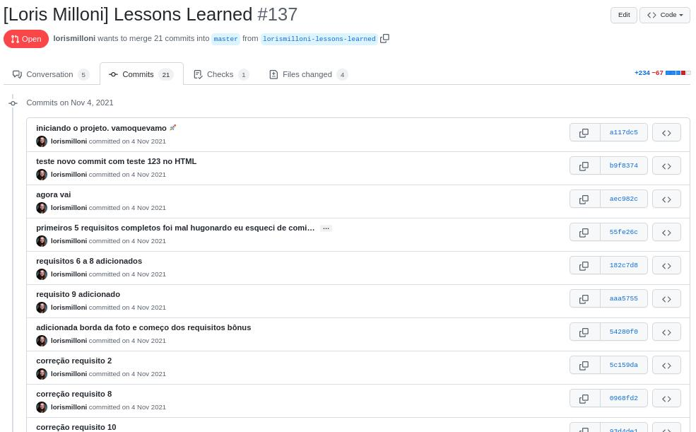
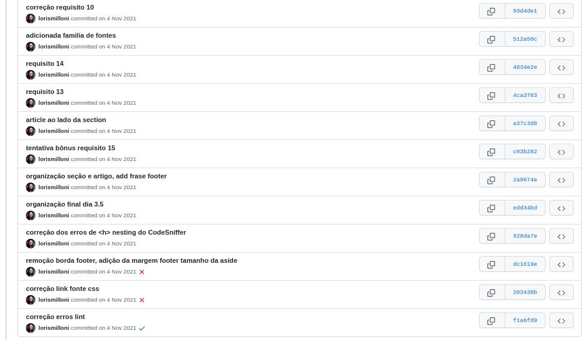
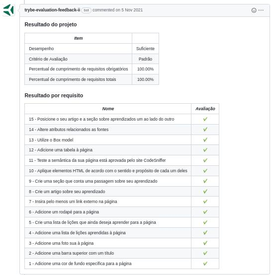

# study-project-lessons-learned

### This is my first web site lesson in Trybe, a web development course.
Made in **09/11/2021**.
### I was learning to use HTML to built web pages, semantic HTML for better accessibility and CSS to style the page and to position the elements.
 

#### Trybe has a private repository with files that can't be shared. So here is my commit history print:

#### Here is the Trybe Evaluator

